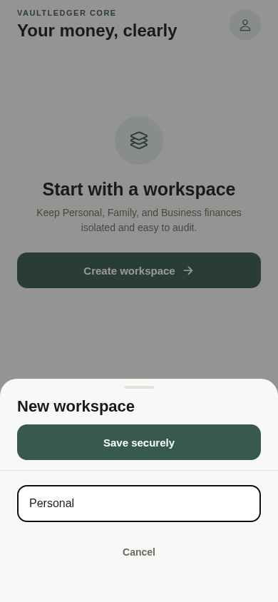
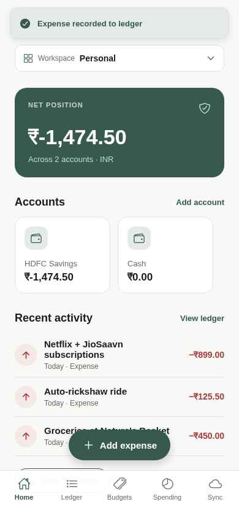
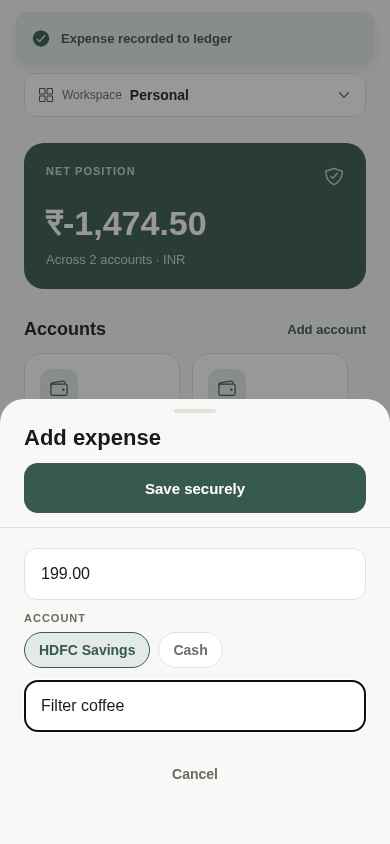
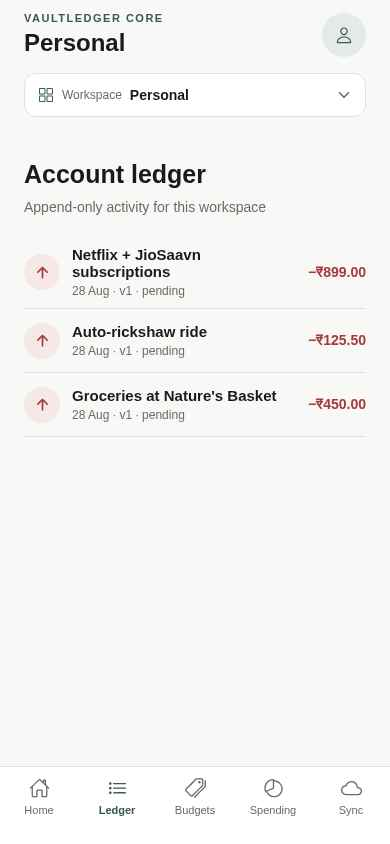
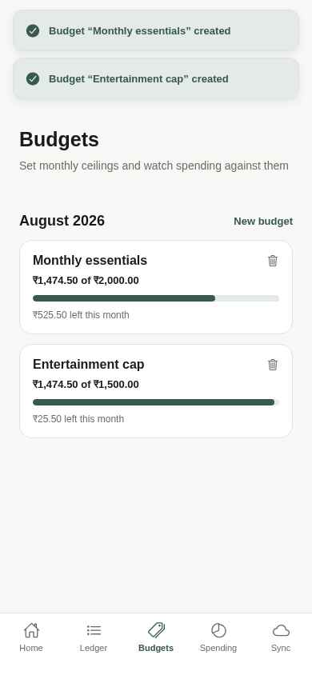
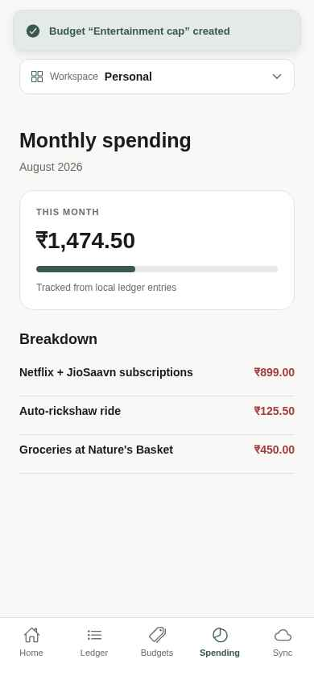
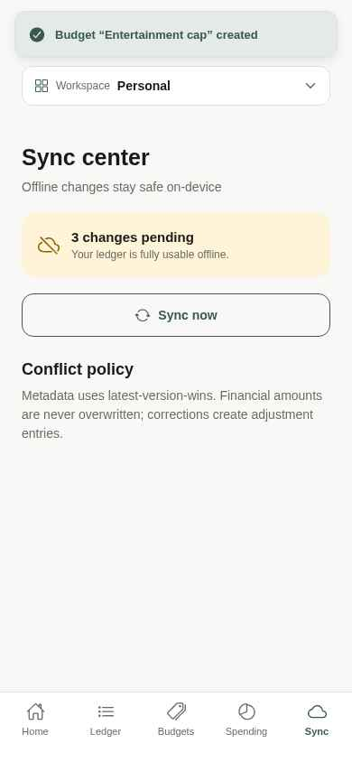
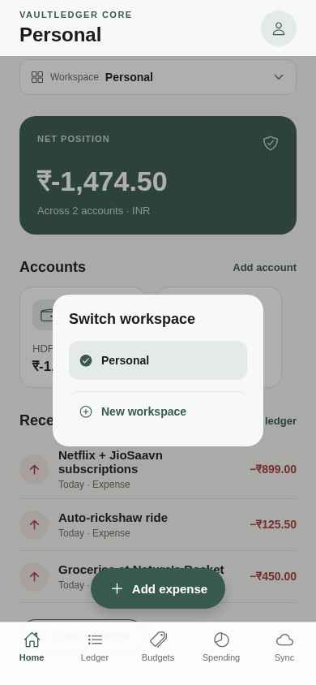

<div align="center">

# VaultLedger Core

**An offline‑first personal & team finance tracker.**
Immutable ledger · Multiple workspaces · Biometric lock · Outbox sync

Built with **Expo (React Native)** + **FastAPI** + **MongoDB**.

</div>

---

## Table of Contents

- [Why VaultLedger?](#why-vaultledger)
- [Screenshots](#screenshots)
- [Feature Highlights](#feature-highlights)
- [Architecture](#architecture)
- [Data Model](#data-model)
- [Getting Started](#getting-started)
- [Environment Variables](#environment-variables)
- [Backend API](#backend-api)
- [Testing](#testing)
- [Project Structure](#project-structure)
- [Design Decisions & Gotchas](#design-decisions--gotchas)
- [Roadmap](#roadmap)

---

## Why VaultLedger?

Most finance trackers treat money like scratch paper — every edit silently rewrites
history and one flaky network call can lose a transaction. VaultLedger Core is the
opposite:

- **Every transaction is append‑only.** Corrections create adjustment entries; the
  original stays intact so you always have an audit trail.
- **Every rupee is a whole number.** Money is stored as integer minor units
  (paise for INR), never as floats — no rounding drift.
- **Every workspace is isolated.** Personal, Family, and Small Business ledgers
  live side‑by‑side without leaking into each other.
- **Every screen works offline.** Local‑first: the app stays fully usable without
  a network. When it comes back, an outbox drains to the server.

---

## Screenshots

<table>
  <tr>
    <td align="center"><b>Onboarding</b></td>
    <td align="center"><b>Create Workspace</b></td>
    <td align="center"><b>Home</b></td>
  </tr>
  <tr>
    <td></td>
    <td></td>
    <td></td>
  </tr>
  <tr>
    <td align="center"><b>Add Expense</b></td>
    <td align="center"><b>Ledger</b></td>
    <td align="center"><b>Budgets</b></td>
  </tr>
  <tr>
    <td></td>
    <td></td>
    <td></td>
  </tr>
  <tr>
    <td align="center"><b>Monthly Spending</b></td>
    <td align="center"><b>Sync Center</b></td>
    <td align="center"><b>Workspace Switcher</b></td>
  </tr>
  <tr>
    <td></td>
    <td></td>
    <td></td>
  </tr>
</table>

> All screenshots captured at a real device viewport (390 × 844).

---

## Feature Highlights

| Area | What it does |
| --- | --- |
| 🔒 **Biometric App Lock** | `expo-local-authentication` prompts on every cold launch on native builds. Auto‑bypasses on web preview so devs can still work. |
| 🗂 **Multiple Workspaces** | Personal / Family / Business share one app but never share data. Every query is scoped by `workspaceId`. |
| 💳 **Multiple Accounts** | Horizontal chip strip on Home; per‑account running balance derived from the ledger. |
| 📒 **Append‑only Ledger** | Every entry shows `version` and `syncStatus`. Rows are never mutated in place. |
| 🎯 **Monthly Budgets** | Set a monthly ceiling; card shows progress against actual spend and turns red on overshoot. |
| 📊 **Monthly Spending** | Current‑month total + a breakdown of recent expenses. |
| ☁️ **Outbox Sync** | Local writes queue up in an outbox. `Sync now` drains the outbox to the FastAPI backend. |
| 🚨 **Sync Failure UX** | Failures surface via both a transient toast **and** a persistent banner with a retry button — no silent failures. |
| ✅ **Conflict Policy** | Metadata: latest‑version‑wins. Amounts: never overwritten — corrections must be new adjustment entries. |

---

## Architecture

VaultLedger follows a **Clean Architecture** split (Domain / Data / Presentation) with
feature‑folder decomposition:

```
frontend/
  src/
    domain/                 # pure types, no framework imports
      finance.ts
    data/                   # persistence (repository) contracts + impl
      finance-repository.ts
    presentation/
      FinanceProvider.tsx   # single source of truth for state + sync
      BiometricGate.tsx     # cold‑launch biometric prompt
    features/               # one folder per user‑facing surface
      home/HomeScreen.tsx
      ledger/LedgerScreen.tsx
      budgets/BudgetsScreen.tsx
      spending/SpendingScreen.tsx
      sync/SyncScreen.tsx
      workspaces/WorkspaceSwitcher.tsx
      sheets/CreationSheet.tsx        # unified bottom‑sheet form
    shared/
      theme.ts
      ui/                   # cross‑feature primitives
        Primitives.tsx
        Toast.tsx
        SyncErrorBanner.tsx
        BottomSheetForm.tsx
    utils/storage/          # cross‑platform key/value wrapper
  app/                      # expo-router entrypoints
    _layout.tsx             # icon‑font pre‑warm + stack
    index.tsx               # tab shell + FAB + provider composition
backend/
  server.py                 # FastAPI routes prefixed with /api
```

Golden rules:

1. **Domain has zero framework imports.** No React, no HTTP, no SQL.
2. **Repository is the only door to persistence.** Screens never touch AsyncStorage directly.
3. **Every query is scoped by `workspaceId`.** No implicit "current account" globals.
4. **Money is `int` everywhere.** Formatting only happens at the UI edge, via `money(minor)`.

---

## Data Model

```ts
Workspace   { id, name, type, ownerId?, createdAt }
Account     { id, workspaceId, name, type, currency, openingBalance, createdAt }
Transaction { id, workspaceId, accountId, type,
              amountMinor, currency, occurredAt, note,
              createdAt, updatedAt, version, syncStatus }
Budget      { id, workspaceId, name, amountMinor, period, createdAt }
OutboxEvent { id, entityType, entityId, operation, payload, retryCount, createdAt }
```

`amountMinor` stores paise (₹125.50 → `12550`). This is enforced at both the Pydantic
boundary (`amount_minor: int = Field(gt=0)`) and the input form (`Math.round(Number(amount) * 100)`).

---

## Getting Started

### Prerequisites

- Node **≥ 20** and Yarn **1.x**
- Python **≥ 3.11**
- MongoDB running locally (or a `MONGO_URL` you can point at)
- Expo Go installed on your phone (optional, for on‑device previews)

### 1. Backend

```bash
cd backend
pip install -r requirements.txt
# uvicorn is auto-started by the process manager; to run manually:
uvicorn server:app --host 0.0.0.0 --port 8001 --reload
```

Visit `http://localhost:8001/api/` — you should see:
```json
{"message":"VaultLedger sync service","policy":"latest-version-wins metadata; financial corrections are adjustments"}
```

### 2. Frontend

```bash
cd frontend
yarn install
yarn expo start          # or use the Emergent preview URL
```

Then either:

- Press `w` to open the web preview, **or**
- Scan the QR code with **Expo Go** on your phone.

> Biometrics only fire on a real device build. In the web preview, the lock screen
> is bypassed so you can iterate freely.

---

## Environment Variables

### `frontend/.env`

| Key | Purpose |
| --- | --- |
| `EXPO_PUBLIC_BACKEND_URL` | Base URL for API calls (`/api/*` is appended by the client). |
| `EXPO_PACKAGER_HOSTNAME` | Emergent‑managed, do not edit. |
| `EXPO_PACKAGER_PROXY_URL` | Emergent‑managed, do not edit. |

### `backend/.env`

| Key | Purpose |
| --- | --- |
| `MONGO_URL` | Mongo connection string. |
| `DB_NAME`  | Mongo database name. |

The frontend `EXPO_PUBLIC_BACKEND_URL` is read via `process.env.EXPO_PUBLIC_BACKEND_URL`
(no fallback — missing config fails fast so you notice).

---

## Backend API

All routes are prefixed with `/api`.

| Method | Path | Purpose |
| --- | --- | --- |
| `GET`  | `/api/` | Health + policy note. |
| `POST` | `/api/workspaces` | Upsert a workspace (idempotent by `id`). |
| `GET`  | `/api/workspaces` | List all workspaces. |
| `POST` | `/api/accounts` | Upsert an account. Requires an existing workspace, otherwise `404`. |
| `GET`  | `/api/accounts/{workspace_id}` | List accounts for a workspace. |
| `POST` | `/api/transactions` | Version‑aware upsert. If the server has a newer version, the request is ignored and the current record is returned. |
| `POST` | `/api/sync` | Batch outbox drain. Each event is validated; invalid payloads return `422` (not `500`). |

Example — draining a single expense event:

```bash
curl -X POST $EXPO_PUBLIC_BACKEND_URL/api/sync \
  -H 'Content-Type: application/json' \
  -d '[{
    "id":"ev-1","entity_type":"transaction","entity_id":"t-1",
    "operation":"create","retry_count":0,"created_at":"2026-02-01T10:00:00Z",
    "payload":{
      "id":"t-1","workspace_id":"w-1","account_id":"a-1",
      "type":"expense","amount_minor":45000,"currency":"INR",
      "occurred_at":"2026-02-01T10:00:00Z","note":"Groceries",
      "created_at":"2026-02-01T10:00:00Z","updated_at":"2026-02-01T10:00:00Z",
      "version":1,"sync_status":"pending"
    }
  }]'
```

---

## Testing

**Backend** — `pytest` covers every route:

```bash
cd backend
pytest -q
```

Currently green: `7/7` — root, workspaces (POST/GET), accounts (POST/GET + 404 for
missing workspace), sync (happy path + empty batch + invalid payload returns 422).

**Frontend** — automated flows via the Emergent testing harness. Every interactive
element carries a `testID` (kebab‑case by role, e.g. `add-expense`, `sheet-save`,
`tab-budgets`) so e2e scripts stay resilient.

---

## Project Structure

```
/app
├── backend/
│   ├── server.py           # FastAPI + Motor
│   ├── requirements.txt
│   └── tests/              # pytest suite
├── frontend/
│   ├── app/                # expo-router entrypoints
│   ├── src/
│   │   ├── domain/
│   │   ├── data/
│   │   ├── presentation/
│   │   ├── features/
│   │   ├── shared/
│   │   └── utils/
│   ├── app.json
│   └── package.json
├── docs/
│   └── screenshots/
└── README.md
```

---

## Design Decisions & Gotchas

- **Append‑only ledger.** `saveTransaction` on the repo *never* takes an `id` to update.
  A correction is a brand‑new entry with `type: "adjustment"`. This means the ledger
  view can always be trusted as history.
- **Money is `int`.** Every conversion happens exactly once, at the form boundary
  (`Math.round(value * 100)`) and once at display (`money(minor)`).
- **`workspaceId` in every query.** The repository filters by workspace before
  returning any data. There is no implicit global.
- **Sticky Save at the top of bottom sheets.** Small viewports + keyboard combos
  used to hide the primary CTA. Save now lives at the top of every creation sheet.
- **Fixed‑position overlays on web.** React Native's `<Modal>` on `react-native-web`
  sizes to *document* height, which pushed sheets below the fold at 390×844. On
  `Platform.OS === "web"` we swap in a `position: fixed` overlay bound to the viewport.
- **Biometric gate on native only.** `expo-local-authentication` isn't available on
  web, so the gate short‑circuits into `unlocked` when `Platform.OS === "web"`.
- **`_id` is always excluded from Mongo responses.** ObjectId isn't JSON serialisable;
  responses are typed as Pydantic models.

---

## Roadmap

- [ ] Per‑category budgets and category picker in the expense sheet
- [ ] Compensating adjustment flow with UI attribution ("Adjusts tx #123")
- [ ] Background sync — flush the outbox automatically when the network returns
- [ ] Shared workspaces (invite‑by‑QR) for Family / Small Business plans
- [ ] Encrypted local database (Drift/SQLite equivalent) once ledger volume grows
- [ ] CI: pytest + expo lint on every push
- [ ] iOS & Android release builds via Emergent's publish flow

---

<div align="center">
Built for people who take their money seriously.
</div>
